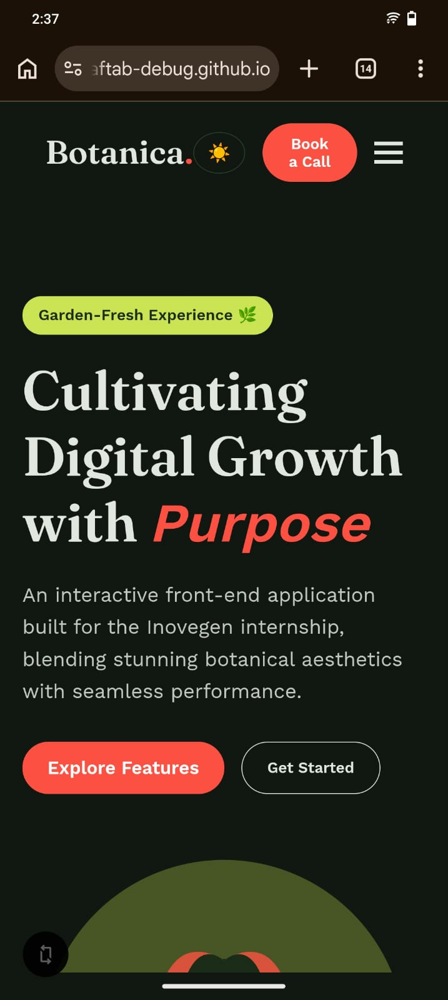

# Botanica — Interactive Website (Task 2)

**Domain:** Web Development — Front-End
**Project by:** Laiba Aftab
**Submitted for:** Inovegen Internship — Task 2

## Overview

Botanica is a responsive, single-page front-end website built with plain HTML, CSS, and JavaScript. It demonstrates a botanical/lifestyle brand landing page with meaningful JavaScript interactivity, semantic markup, and a fully responsive layout across desktop, tablet, and mobile.

**Live demo:** https://laibapafaftab-debug.github.io/botanica-interactive-website/

## Project Structure

```
botanica-interactive-website/
├── index.html      # Page markup (semantic HTML5)
├── style.css        # All styling, theme variables, responsive layout, animations
├── script.js         # All JavaScript interactivity
└── README.md
```

## How to Run Locally

1. Download or clone the project folder.
2. Open `index.html` directly in any modern browser (no build step or server required).

No dependencies to install — Google Fonts are loaded via CDN link in `index.html`.

## Features

### Design
- Custom color system using CSS variables (sage-white, deep forest green, coral, and lime accents)
- Typography pairing: Fraunces (serif, headings) + Work Sans (body text)
- Asymmetric hero layout and zigzag feature rows for a distinctive, non-templated feel
- Custom inline SVG illustration (no external image assets)

### JavaScript Interactivity
1. **Mobile menu toggle** — hamburger menu opens/closes the nav on smaller screens
2. **Dark/light theme toggle** — theme preference is saved to `localStorage` and persists across sessions
3. **FAQ accordion** — expand/collapse question items with animated height transition
4. **Testimonial carousel** — previous/next controls cycle through peer reviews
5. **Contact form validation** — client-side checks for empty fields before showing a success message
6. **"Book a Call" modal** — opens from two entry points (nav and hero), closes via close button or outside click

### Animations
- One-time fade + slide-up animation on page load for the hero text and illustration
- Scroll-reveal: each section (Features, Steps, Reviews, FAQ, Contact) fades and slides into view as the user scrolls
- Staggered reveal for the Steps and FAQ list items
- Respects `prefers-reduced-motion` for accessibility — animations are disabled for users who have that setting on

### Responsiveness
- Built with CSS Grid and Flexbox throughout
- Breakpoint at 768px collapses the hero/zigzag grid to a single column and switches the nav to a mobile hamburger menu
- Tested across desktop, tablet, and mobile widths

## Tech Stack

- HTML5 (semantic elements: `header`, `nav`, `section`, `footer`)
- CSS3 (custom properties, Grid, Flexbox, keyframe animations, media queries)
- Vanilla JavaScript (no frameworks or libraries)

## Screenshots

**Desktop**


**Mobile**


